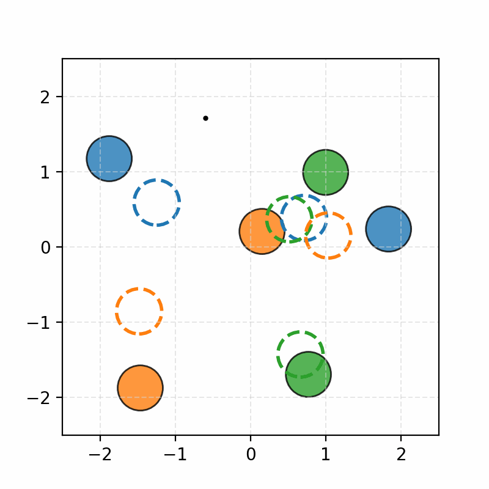

# Spatial Representation Findings: Deep-LTL Agent Analysis

## Executive Summary

Our investigation into the internal representations of a reinforcement learning agent trained on Linear Temporal Logic (LTL) tasks revealed several key insights about how the model represents goals and spatial information. The most significant finding is that the model uses **egocentric spatial representations** rather than allocentric world maps, which explains both the success and limitations of our probing experiments.

## Key Findings

### 1. Goal Representation in LTL Network (94% Accuracy)

**Experiment**: We trained a linear probe on the LTL-RNN's hidden state to predict the agent's immediate subgoal.

**Results**: 
- Achieved 94% accuracy in predicting the next goal proposition (blue vs green)
- The immediate goal is linearly represented in the LTL network's hidden state
- This confirms the model maintains explicit goal information in its internal representations

**Implication**: The model's high-level planning is transparent and interpretable through simple linear probes.

### 2. Steering Experiments: Goal Selection vs. Goal Execution

**Goal Execution Steering**: Successfully steered the agent's behavior by directly manipulating the explicit goal sequence. The agent reliably followed modified goal sequences.

**Goal Selection Steering**: Failed to influence the agent's choice of goal sequence by steering the underlying value function. Even with large steering coefficients, the agent's chosen goal sequence remained unchanged.

**Implication**: The goal selection process appears to be either deterministic or highly insensitive to value function manipulations, while goal execution is more malleable.

### 3. Spatial Representation: The Critical Discovery

#### Initial Misleading Results (Perfect Accuracy)
**Experiment**: Trained probes to predict zone coordinates from model activations using static snapshots from different worlds.

**Results**: Near-perfect accuracy in predicting zone locations.

**Problem**: This was an experimental artifact. Each world had a unique initial lidar signature, so the probe simply memorized the mapping from world fingerprint to static coordinates.

#### Dynamic Probing Reveals Egocentric Representation
**Experiment**: Trained probes on initial states but evaluated them during dynamic rollouts where the agent moved through the environment.

**Results**: The "compass phenomenon" - predicted goal locations moved dynamically with the agent, always pointing from the agent's current position toward true goal locations.

**Key Insight**: The model represents spatial information **egocentrically** (relative to the agent) rather than **allocentrically** (in world coordinates).

#### Visual Evidence: The Compass Phenomenon

The following visualizations demonstrate the egocentric nature of the model's spatial representation:

*Static snapshots showing how predicted goal locations (dashed circles) move with the agent's position. When predictions fall outside the visible grid, they are anchored to the boundary while preserving the relative direction from the agent.*

*Enhanced visualization showing the agent's trajectory colored by its current goal. The trajectory color indicates which goal the agent is pursuing at each moment, making it easier to see how the agent tracks the corresponding predicted zone (dashed circle of the same color).*

*Animated visualization showing the dynamic "compass" behavior. The predicted goal locations (dashed circles) continuously update to point from the agent's current position toward the true goal locations (solid circles), revealing the egocentric nature of the model's spatial representation.*

*Animated visualization with goal-colored trajectory. The agent's path is colored according to its current goal, clearly showing how it tracks the corresponding predicted zone as both move dynamically through the environment.*

**Key Observations from Visualizations:**
- **True zones** (solid circles) remain fixed in world coordinates
- **Predicted zones** (dashed circles) move dynamically with the agent
- **Agent trajectory** is colored by the current goal being pursued
- When predictions fall outside the grid, they are anchored to the boundary while preserving the relative direction
- The model's internal representation acts like a "compass" that always points toward goals relative to the agent's current position
- The goal-colored trajectory makes it clear that the agent is tracking the predicted zone of the same color, demonstrating the egocentric nature of its spatial reasoning

## Technical Details

### Environment Observations
The model receives:
- Proprioceptive data (accelerometer, etc.)
- **Egocentric lidar sensor readings** indicating distances to objects in various directions around the agent
- **No explicit zone coordinates** are provided

### Probing Methodology
- **Static probing**: Train on initial states from multiple worlds, test on others
- **Dynamic probing**: Train on initial state, evaluate during rollout
- The dynamic approach is more rigorous and reveals the true nature of spatial representations

### Why Dynamic Probing is More Natural
1. **Tests consistency**: Does the model maintain a stable understanding of space over time?
2. **Reveals representation type**: Egocentric vs. allocentric
3. **Avoids memorization**: Prevents the probe from simply memorizing world-specific patterns

## Implications

### For Model Interpretability
- High-level goals are linearly represented and easily interpretable
- Spatial reasoning is agent-relative, not world-absolute
- The model builds dynamic, context-dependent spatial representations

### For Steering and Control
- Direct goal manipulation is effective for behavior control
- Value function steering is ineffective for high-level planning
- Spatial steering would need to work in egocentric coordinates

### For Understanding Neural Representations
- The model's internal "map" is not a static world map but a dynamic, agent-centered representation
- This aligns with how biological agents often represent space (e.g., place cells in hippocampus)
- The representation is optimized for action rather than abstract spatial reasoning

## Conclusion

The agent's spatial representation is fundamentally **egocentric and action-oriented**. While this explains the "compass" behavior we observed, it also suggests the model's spatial understanding is more like a "you-are-here" map than a traditional allocentric world map. This finding has important implications for how we should approach steering, interpretability, and understanding of the model's internal representations.

The key lesson is that probing experiments must be carefully designed to distinguish between memorization artifacts and genuine understanding. The dynamic probing approach revealed the true nature of the model's spatial reasoning, while static probing gave misleadingly perfect results. 