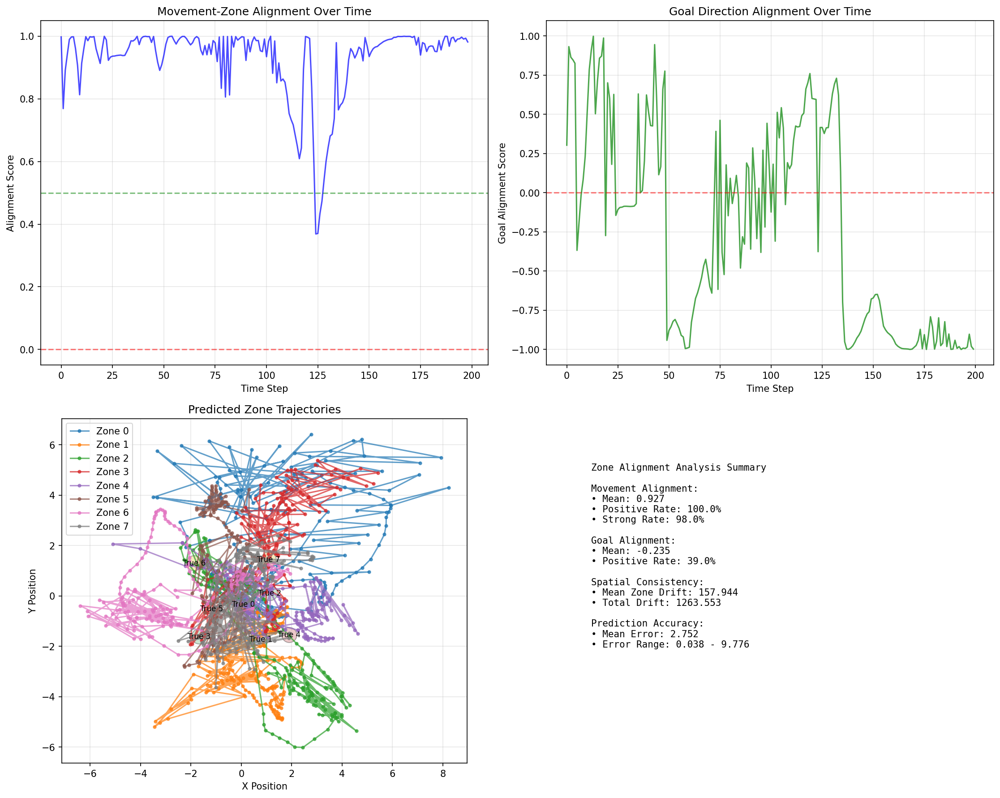

# Zone Alignment Analysis Report

**Experiment:** PointLtl2-v0, `big_test`  
**Formula:** GF blue & GF green  
**Layer Probed:** `actor.enc.2`  
**Worlds Sampled:** 50  
**Rollout Steps:** 200

---

## Objective

To quantitatively analyze how the internal representations of the agent's neural network encode spatial zone information, and how these representations align with the agent's movement and goal-seeking behavior.

---

## Methods

- **Probing:** Linear probes (Ridge for position, Logistic Regression for color) were trained on activations from the selected network layer to predict the positions and colors of zones in the environment.
- **Rollout Analysis:** The agent was rolled out in a sampled world, and at each step, the probe predicted zone positions and colors from the current hidden state.
- **Metrics:**
  - **Movement Alignment:** Cosine similarity between the agent's movement direction and the direction to the nearest predicted zone.
  - **Goal Alignment:** Cosine similarity between the direction to the true goal and the direction to the predicted zone of the same color.
  - **Spatial Consistency:** Total drift (distance traveled) of predicted zone positions over the rollout.
  - **Prediction Accuracy:** Euclidean distance between predicted and true zone positions.

---

## Results

- **Movement Alignment:**  
  - Mean: **0.927** (very high)  
  - Positive Rate: **100%**  
  - Strong Rate (>0.5): **98%**
- **Goal Alignment:**  
  - Mean: **-0.235** (slightly negative; predicted goal zone is not always in the true goal direction)
- **Spatial Consistency:**  
  - Mean Zone Drift: **157.94**
- **Prediction Accuracy:**  
  - Mean Error: **2.75** (distance units in environment)

### Visualization

*Figure: Alignment scores over time, zone drift trajectories, and summary statistics.*

---

## Interpretation

- The agent's movement is highly aligned with the *nearest* predicted zone direction, supporting the hypothesis that the network encodes a "compass" or behavioral guide rather than a static map.
- The predicted goal zone is not always in the true goal direction, and can even be anti-aligned, indicating a dynamic, context-dependent representation.
- Predicted zones drift significantly over time, further supporting the idea of a non-static, behaviorally relevant encoding.

---

## Conclusion

The internal representations in the probed layer do not encode a literal map of the environment. Instead, they act as a dynamic, context-sensitive guide, pointing the agent in directions that are behaviorally relevant for reaching goals. This distributed, non-localized encoding is robust and flexible, but not directly interpretable as a static spatial map.

---

**Next steps:**  
- Probe other layers or networks for comparison.  
- Analyze alignment for different goals or more complex tasks.  
- Investigate temporal evolution of zone representations in more detail. 