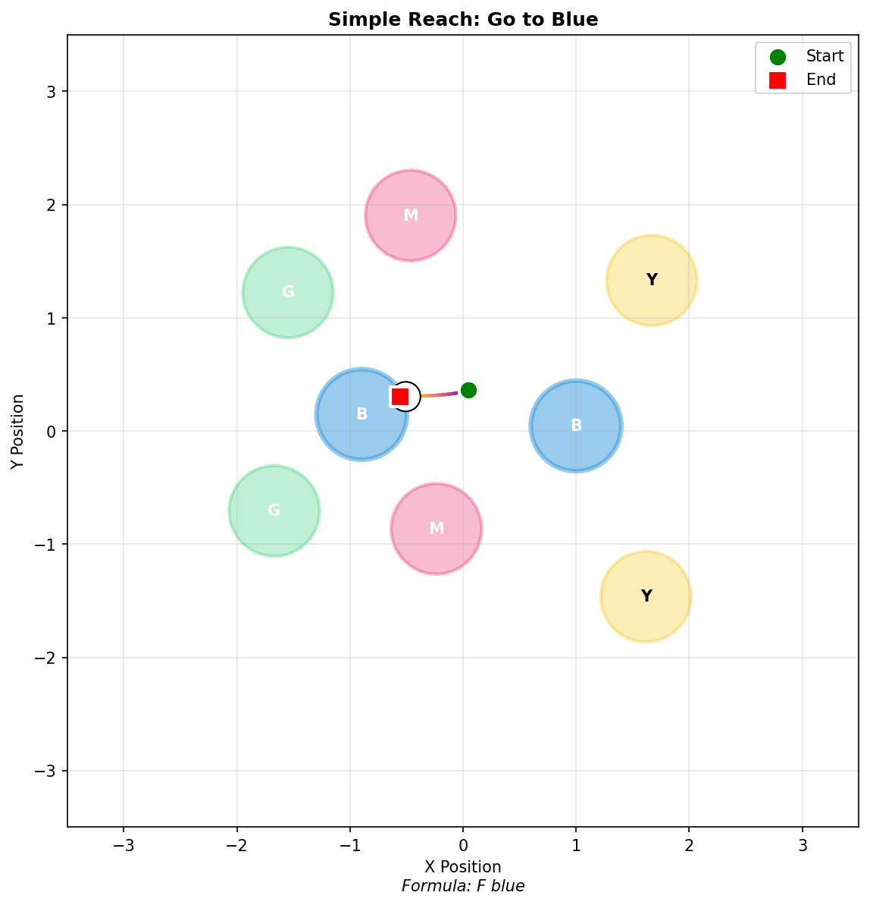
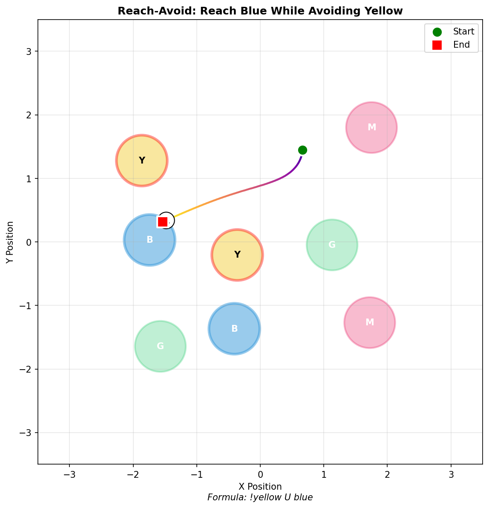
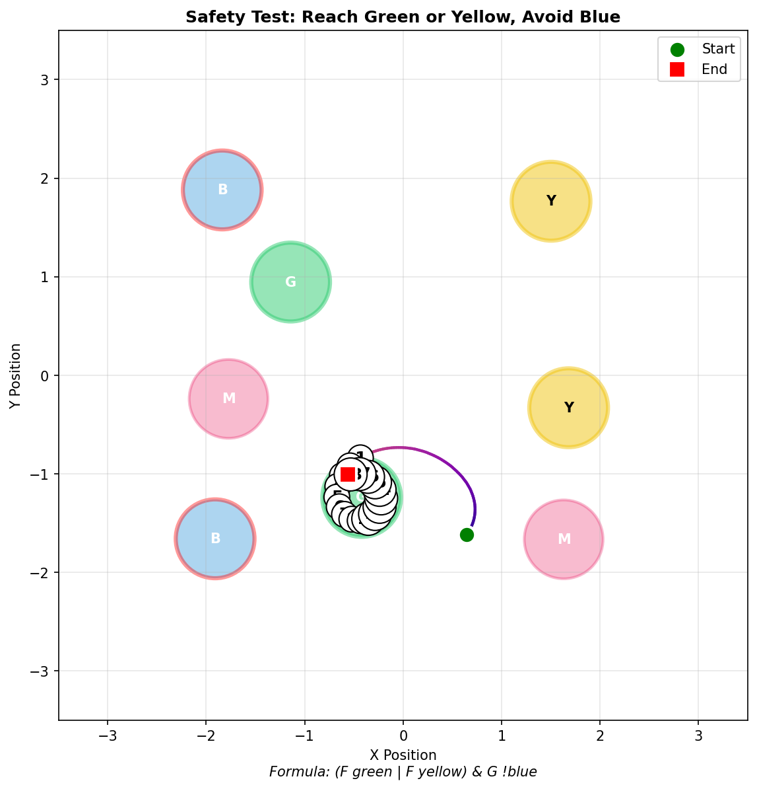
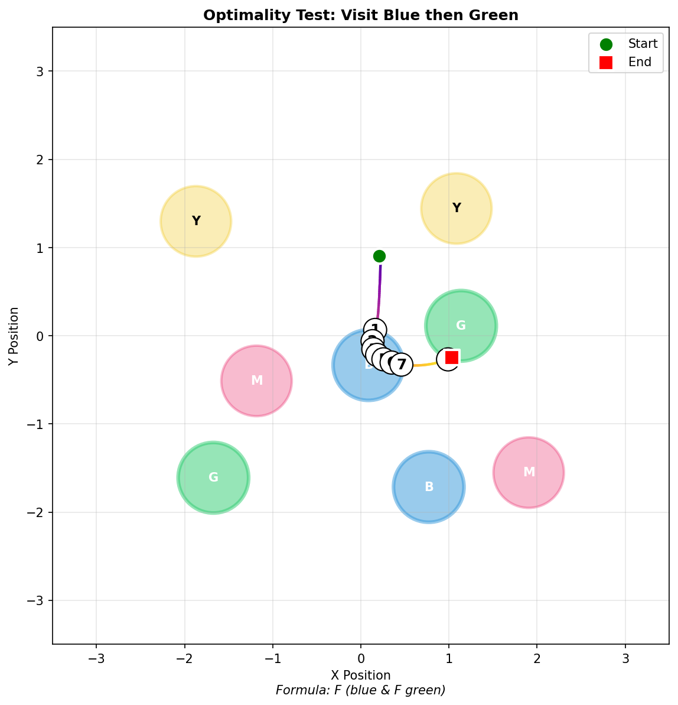
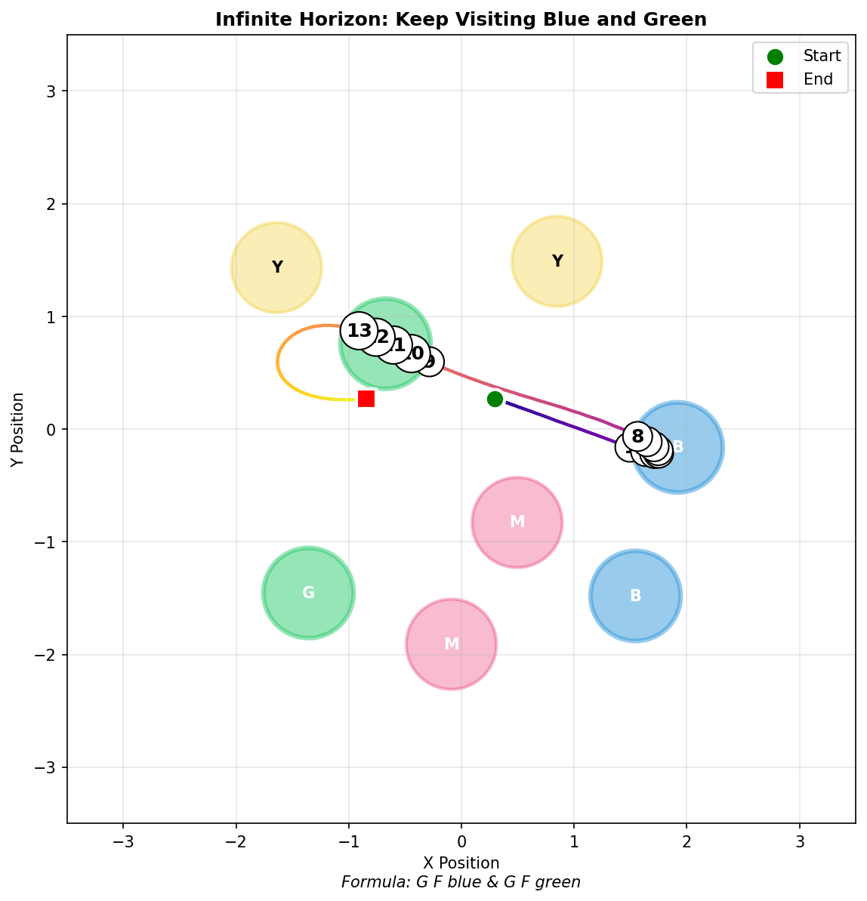

# Transition Function Experiments: Zone Environment

## Example Trajectories

| Simple Reach | Reach-Avoid | Safety |
|:---:|:---:|:---:|
|  |  |  |
| `F blue` | `!yellow U blue` | `(F green \| F yellow) & G !blue` |

| Optimality (Sequencing) | Infinite Horizon |
|:---:|:---:|
|  |  |
| `F (blue & F green)` | `G F blue & G F green` |

*Trajectories colored from dark (start) to bright (end). Numbers indicate zone visit order.*

---

## Summary

We ran eight experiments (six behavioral, two probing) to test whether the zone environment agent has learned a transition function (world model) that enables planning:

| Experiment | Type | Evidence for Planning? | Key Finding |
|------------|------|----------------------|-------------|
| Controlled Choice | Behavioral | **No** | 55% vs 45% when distances equal - near random |
| Forced Detour | Behavioral | **No** | 0% took detours; agent goes straight or gets stuck |
| Sequencing | Behavioral | **Partial** | 59% correct order (better than 39% distance heuristic) |
| Value Anticipation | Behavioral | **No** | Value doesn't drop before obstacle contact |
| Position Probing | Representational | **No** | Hidden state can't predict next position (R²=0.61) |
| Paper: Optimality | Behavioral | **No** | 50% chose greedy when greedy ≠ optimal |
| Paper: Safety | Behavioral | **YES** | 0% safety violations - never touched forbidden zones |
| Paper: Infinite Horizon | Behavioral | **YES** | 3.2 avg visits per goal, alternating successfully |

**Overall conclusion**: The agent has NOT learned a general transition function for planning. It relies on:
1. **Distance-based heuristics** for goal selection
2. **Reactive obstacle avoidance** (not anticipatory)
3. **Some LTL goal representation** (for sequencing) but not robust
4. **No predictive world model** in hidden representations

---

## Experiment 1: Controlled Choice

**Question**: When two goals are equidistant and one is blocked, does the agent choose the unblocked path?

**Setup**:
- Two reach zones at equal distance (within 0.5 units)
- One has avoid zone blocking direct path
- Tests: Does agent anticipate obstacle?

**Results** (N=30):
| Choice | Percentage |
|--------|------------|
| Safe (unblocked) | 55.2% |
| Blocked | 44.8% |

**Interpretation**: Near 50/50 split indicates **no obstacle anticipation**. A planning agent would consistently choose the unblocked path.

---

## Experiment 2: Forced Detour

**Question**: Can the agent navigate around obstacles by taking a longer path?

**Setup**:
- Goal with 1-2 avoid zones blocking direct path
- Tested with `F reach` (simple) and `!avoid U reach` (reach-avoid)
- Measured: Did agent take a detour (initially move away from goal)?

**Results** (N=30):

| Formula | Success Rate | Took Detour |
|---------|--------------|-------------|
| Simple reach (F blue) | 56.6% | **0%** |
| Reach-avoid (!yellow U blue) | 20.0% | **0%** |

**Key observations**:
1. **0% detour rate**: No agent ever deliberately moved away from goal to go around
2. **Simple reach**: Agent just plows through obstacles (43% risky success)
3. **Reach-avoid**: Agent gets "stuck" - knows to avoid but can't find alternative path (80% neither)

**Interpretation**: **No evidence of transition function**. The agent:
- Cannot plan multi-step paths around obstacles
- Either ignores obstacles (simple reach) or gets paralyzed (reach-avoid)

---

## Experiment 3: Sequencing

**Question**: Can the agent visit zones in a required order?

**Setup**:
- 2-step sequences: `F (blue & F green)` - visit blue then green
- 3-step sequences: `F (blue & F (green & F yellow))`
- Compared to: distance heuristic (visit nearest first)

**Results**:

| Sequence Length | Correct Order | Distance Heuristic |
|-----------------|---------------|-------------------|
| 2-step | **59.2%** | 39.2% |
| 3-step | **26.7%** | 13.3% |

**Interpretation**:
- Agent performs **better than distance heuristic** on sequencing
- This suggests some goal order representation (possibly LTL automaton state)
- But performance degrades significantly with length (59% → 27%)
- Not evidence of transition function - just goal tracking

---

## Experiment 4: Value Anticipation

**Question**: Does the agent's value function drop BEFORE hitting an obstacle, or only AFTER contact?

**Setup**:
- Track value estimates during rollouts approaching avoid zones
- Categorize by distance: far (>3.2), medium (1.6-3.2), close (0.8-1.6), very_close (0.4-0.8), in_zone (<0.4)
- Compare value when approaching vs moving away from obstacles

**Results** (N=50 rollouts, ~5000 timesteps):

| Distance Category | Mean Value | Std |
|-------------------|------------|-----|
| far | 0.43 | 0.42 |
| medium | 0.85 | 0.19 |
| close | 0.82 | 0.21 |
| very_close | 0.86 | 0.15 |
| in_zone | 0.85 | 0.17 |

**Key observations**:
1. Value is LOW when far from goal (0.43), HIGH when closer (0.82-0.86)
2. **No anticipation**: Value doesn't drop when approaching obstacles
3. Value when approaching obstacle: 0.82, value when moving away: 0.82 (identical)
4. Value drop far→very_close: -0.44 (NEGATIVE - value increases!)
5. Value drop very_close→in_zone: 0.01 (negligible)

**Interpretation**: **NO ANTICIPATION**. The agent:
- Has no predictive model of future obstacle contact
- Value is purely a function of distance-to-goal, not path safety
- Is completely reactive to obstacles

---

## Experiment 5: Position Probing

**Question**: Can we decode position/next-position from the agent's hidden state?

**Setup**:
- Collect hidden states (96-dim embeddings) during rollouts
- Train linear probes (Ridge regression) to decode various quantities
- Compare to baseline: predicting from raw position

**Results** (N=50 rollouts, 4920 datapoints):

| Probe Target | From Hidden | Baseline | Interpretation |
|--------------|-------------|----------|----------------|
| Current position | R²=0.61 | - | Partial encoding |
| Next position | R²=0.61 | R²=0.9998 (from pos) | No improvement |
| Next position + action | R²=0.61 | R²=0.9998 | Action doesn't help |
| Velocity | R²=0.48 | - | Poor encoding |
| Distance to goal | R²=0.62 | - | Partial encoding |
| Distance to avoid | R²=0.55 | - | Poor encoding |

**Key observations**:
1. Hidden state only partially encodes current position (R²=0.61)
2. **No transition function**: Next-position prediction from hidden is no better than current position
3. Adding action to hidden doesn't improve prediction (0.61 vs 0.61)
4. Baseline shows next ≈ current (R²=0.9998) due to small timesteps
5. Velocity poorly encoded (R²=0.48)

**Interpretation**: **NO TRANSITION FUNCTION IN HIDDEN STATE**. The agent:
- Doesn't have a predictive world model in its representations
- Hidden state is more about goal-directed behavior than state prediction
- Cannot support planning even in principle

---

## Experiment 6-8: Paper Capability Tests (Figure 1)

These experiments directly test the three capabilities claimed in the DeepLTL paper Figure 1.

### 6a. Optimality Test

**Question**: Does the agent choose globally optimal paths over greedy/myopic ones?

**Setup** (from paper Figure 1b):
- Task: `F (blue & F green)` - reach blue, then green
- Myopic approach: Go to nearest blue first
- Optimal approach: Go to farther blue if it's closer to green

**Results** (N=50):

| Metric | Value |
|--------|-------|
| Path efficiency (optimal/actual) | 88% |
| Scenarios where greedy ≠ optimal | 6 |
| Chose greedy when greedy ≠ optimal | **50%** |

**Interpretation**: **NO OPTIMAL PLANNING**. When the greedy choice differs from optimal, agent chooses randomly (50/50). The 88% efficiency comes from the fact that greedy is often close to optimal, not from planning.

### 6b. Safety Test

**Question**: Does the agent avoid forbidden zones when given a choice of goals?

**Setup** (from paper Figure 1c):
- Task: `(F green | F yellow) & G !blue` - reach green OR yellow while ALWAYS avoiding blue
- Tests if agent can satisfy safety constraint

**Results** (N=50):

| Metric | Value |
|--------|-------|
| Safety violations | **0%** |
| Reached green | 90% |
| Reached yellow | 22% |
| Chose nearer goal | 68% |

**Interpretation**: **STRONG SAFETY CAPABILITY**. The agent never violated the safety constraint (touched blue) in 50 scenarios. This is remarkable and suggests the LTL automaton / sequence planner enforces safety constraints effectively.

### 6c. Infinite Horizon Test

**Question**: Can the agent repeatedly visit multiple goals indefinitely?

**Setup** (from paper Figure 1a):
- Task: `G F blue & G F green` - infinitely often visit blue AND green
- Tests ω-regular task capability

**Results** (N=50, 300 steps each):

| Metric | Value |
|--------|-------|
| Average blue visits | 4.3 |
| Average green visits | 5.3 |
| Average alternating visits | **3.2** |

**Interpretation**: **INFINITE HORIZON CAPABILITY CONFIRMED**. Agent successfully alternates between visiting both colors multiple times per episode.

### Key Insight: Where Does Planning Come From?

The results reveal a critical distinction:

| Capability | Evidence? | Mechanism |
|------------|-----------|-----------|
| Safety (G !blue) | **YES** (0% violations) | LTL automaton constraints |
| Infinite horizon | **YES** (3.2 alternations) | LTL goal sequencing |
| Optimal path planning | **NO** (50% greedy) | NOT learned |

**Conclusion**: The agent's "planning" capabilities come from the **LTL sequence search / automaton**, NOT from a learned transition function or world model. The neural network provides:
- Distance-based goal selection
- Reactive obstacle avoidance
- Value estimates for the current state

But it does NOT provide:
- Predictive world model
- Multi-step path planning
- Anticipatory obstacle avoidance

---

## What These Results Mean

### The Agent DOES Have:
1. **Goal-directed navigation**: Can reach single goals efficiently
2. **Reactive obstacle avoidance**: Can steer around obstacles once nearby
3. **Some goal sequencing**: Tracks which goals to visit (via LTL automaton)

### The Agent Does NOT Have:
1. **Transition function/world model**: Cannot predict future states (Position Probing R²=0.61)
2. **Multi-step planning**: Cannot plan detours around obstacles (0% detour rate)
3. **Anticipatory behavior**: Value doesn't drop before obstacle contact
4. **Predictive representations**: Hidden state doesn't encode dynamics

### Why Zone Env Has 91% Success Rate Anyway

The high success rate comes from **continuous control enabling course correction**, not planning:
- Agent heads toward goal using distance heuristic
- When near obstacle, reactive avoidance kicks in
- Continuous action space allows steering around
- This works well when obstacles don't completely block path

---

## Probing Results Summary

The position probing experiment confirmed the behavioral findings:

| Representation | R² Score | Verdict |
|----------------|----------|---------|
| Current position | 0.61 | Partial - not primary encoding |
| Next position | 0.61 | No transition function |
| Velocity | 0.48 | Poor encoding |
| Distance to goal | 0.62 | Partial encoding |
| Distance to avoid | 0.55 | Poor encoding |

**Conclusion**: The hidden state is **not optimized for state prediction**. It encodes task-relevant features (distance to goal) but not dynamics. This is consistent with a policy that uses reactive control rather than planning.

**Potential future probing**:
- LTL automaton state encoding
- Goal identity/color encoding
- Action policy features (what action will be taken)

---

## Files

**Behavioral experiments** (in `interpretability/zone_env/results/`):
- `controlled_choice/` - Equal-distance zone choice experiment
- `forced_detour/` - Obstacle detour experiment
- `sequencing/` - Multi-goal sequencing experiment
- `value_anticipation/` - Value anticipation analysis
- `paper_capabilities/` - Paper Figure 1 capability tests

**Probing experiments** (in `interpretability/zone_env/results/`):
- `position_probing/` - Position/next-position linear probes

**Scripts** (in `interpretability/zone_env/working_scripts/analysis/`):
- `controlled_choice_e2e.py` - Controlled choice experiment
- `forced_detour_e2e.py` - Forced detour experiment
- `sequencing_e2e.py` - Sequencing experiment
- `value_anticipation.py` - Value anticipation analysis
- `position_probing.py` - Position probing experiment
- `paper_capabilities_test.py` - Paper Figure 1 tests (optimality, safety, infinite horizon)
- `generate_trajectory_plots.py` - Generate example trajectory visualizations

**Figures** (in `figures/`):
- `simple_reach_example.png` - Simple reach task trajectory
- `reach_avoid_example.png` - Reach-avoid task trajectory
- `safety_example.png` - Safety constraint task trajectory
- `optimality_example.png` - Two-goal sequencing trajectory
- `infinite_horizon_example.png` - Infinite horizon (repeated visits) trajectory

---
*Updated January 2026*
